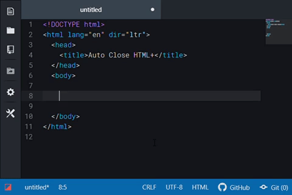

# Auto Close HTML+

[](https://travis-ci.com/binaryfunt/autoclose-html-plus)


Will automatically add closing tags when you type <kbd>&gt;</kbd> to complete the opening tag, in HTML, XML and Markdown files.

This is forked from the [Auto Close HTML package](https://atom.io/packages/autoclose-html) which is no longer being maintained.



> Other packages used in the above screen: [Threshold UI](https://atom.io/themes/threshold-ui), [Convergent Syntax](https://atom.io/themes/convergent-syntax), [Tool Bar](https://atom.io/packages/tool-bar) with [Flex Tool Bar](https://atom.io/packages/flex-tool-bar), and [Minimap](https://atom.io/packages/minimap)


## Installation

### In Atom

In settings, click the "Install" tab and search for "autoclose-html-plus".

### Command line

```
apm install autoclose-html-plus
```


## Usage

Under normal circumstances ending tags will be inserted on the same line for inline elements, e.g.,

```html
<span>|</span>
```

or two lines down with indentation for block elements, e.g.,

```html
<div>
  |
</div>
```

You can use the [Force Inline](#force-inline) and [Force Block](#force-block) options to override this. A single undo after autoclosing a block element will put the closing tag back on the same line, i.e., `<div>|</div>`. A second undo will remove the closing tag.


## Bug Reports and Contributing

If you find a bug, please feel free to file an issue, and/or try fixing it yourself and submitting a PR.


## Options

### Force Inline

Elements in this comma delimited list will render their closing tags on the same line, even if they are block by default. You can set this to `*` to force all closing tags to render inline.

### Force Block

Elements in this comma delimited list will render their closing tags after a tabbed line, even if they are inline by default. A value of `*` for Force Inline overrides all values in Force Block.

### Never Close

Elements in this comma delimited list should *not* render a closing tag.

### Make Never Close Elements Self Closing

Will convert elements in Never Close list from `<tag>` to `<tag />`

### Make Unrecognized Elements Block Tags

Elements that aren't standard HTML tags (e.g., custom XML tags) will be made block tags by default.

### Legacy/International Mode

Enables the old style of completion detection using buffer events rather than keybindings. Non-QWERTY keyboards might not correctly fire events when <kbd>&gt;</kbd> is pressed and/or fire events for entirely different keys. **Please note that this mode is buggy (i.e. can complete after undo) and may not be compatible with new features and bug fixes in future releases, post-0.22.0**. If/when the core issues behind keybindings not reporting correctly on international keyboards is solved this option may be removed.


## Changelog

#### 0.27.2
- Re-order package settings in Atom settings view
- Update README documentation

#### 0.27.1
- Fix uncaught TypeError when no opening `<` is present and the line is less than 10 below the zeroth line (thanks to [UziTech](https://github.com/UziTech))

#### 0.27.0
- Tags broken over lines now autoclose

#### 0.26.0
- Add option for unrecognised tags (e.g. custom XML tags) to be made block tags (enabled by default)

#### 0.25.0 (forked from [autoclose-html](https://atom.io/packages/autoclose-html))
- Add support for XML and markdown files
- Allow backtracking from automatic block tag to inline with single undo / Ctrl+Z

#### 0.24.0
- Stopped self closing tags from auto closing

#### 0.23.0
- Added legacy mode for users having problems with event handling introduced in 0.22.0

#### 0.22.0
- Better way of handling events, solves rebinding problems **and** having to define grammars to apply to

#### 0.21.0
- Fixed double closing after changing grammar

#### 0.20.0
- HTML (Jinja Templates), Ember HTMLBars, JavaScript with JSX added to default grammars, per user requests
- Dispose events on deactivate (should prevent double closing after an upgrade in the future, although I don't think it will help for this release)
- Added ability to use "\*" for Force Inline Options
- Some Readme cleanup
