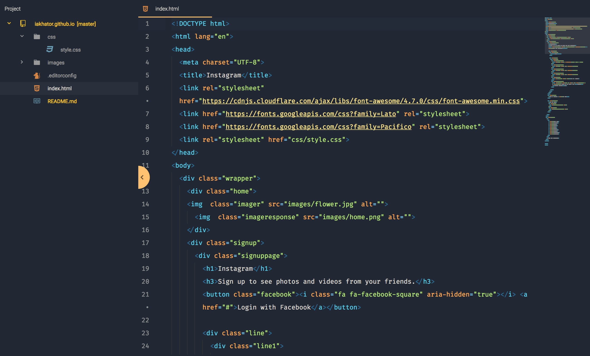
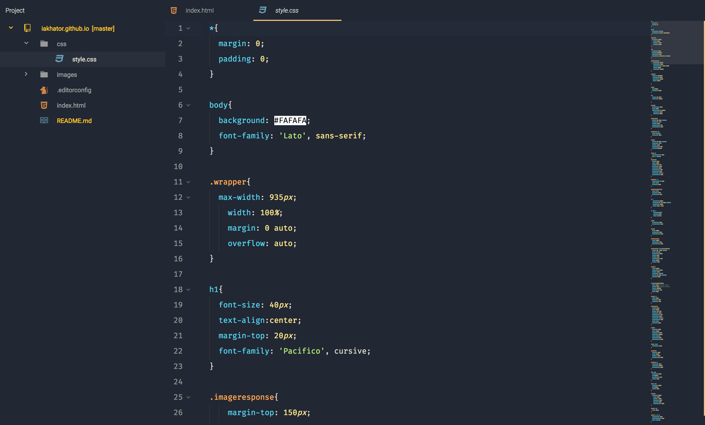

# Ayu Mirage Atom Syntax Theme
  ---

AThis theme is based of on the Ayu Mirage Color Scheme by  @dempfi - [Ayu](https://github.com/dempfi/ayu).
I simply changed somethings to give it my custom feel

### Screenshots

<h6 align='center'>Ayu Mirage Atom Syntax<code>html</code> files</h6>
  

  
  ---

<h6 align='center'>Ayu Mirage Atom Syntax<code>css</code> files</h6>
  

  
  ---

<h6 align='center'>Ayu Mirage Atom Syntax<code>js</code> files</h6>
  

  ---

## Install
Install Ayu Mirage Atom Syntax Theme via Atom by going to [Preferences/Settings > Install > Theme] and search for Ayu Mirage Atom Syntax Theme or install through CLI

`$ apm install ayu-mirage-atom-syntax`

## UI Theme
The Ui theme used in the screenshots is [Material UI](https://atom.io/themes/atom-material-ui) with a little tweak.

  ---
atom-ayu-ui coming soon ...