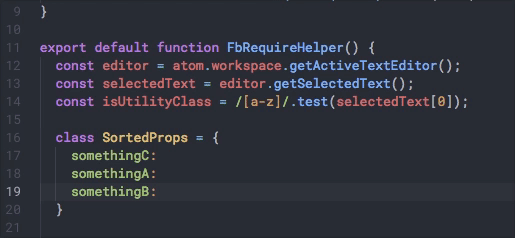

# Expand Selection To Indentation



- Adds Atom shortcuts to expand selection of vertical lines of text with the same indentation.
- Works similar to Sublime "Expand Selection to Indentation" but with more granularity since you can go up or down based on the current line.
- Particularly useful for selecting blocks of text that you'd like to then sort.

## keymap.json

This is the default keymap.json. Feel free to update it.

```
'atom-workspace':
  'alt-shift-down': 'expand-selection-to-indentation:select-down'
  'alt-shift-up': 'expand-selection-to-indentation:select-up'
```
