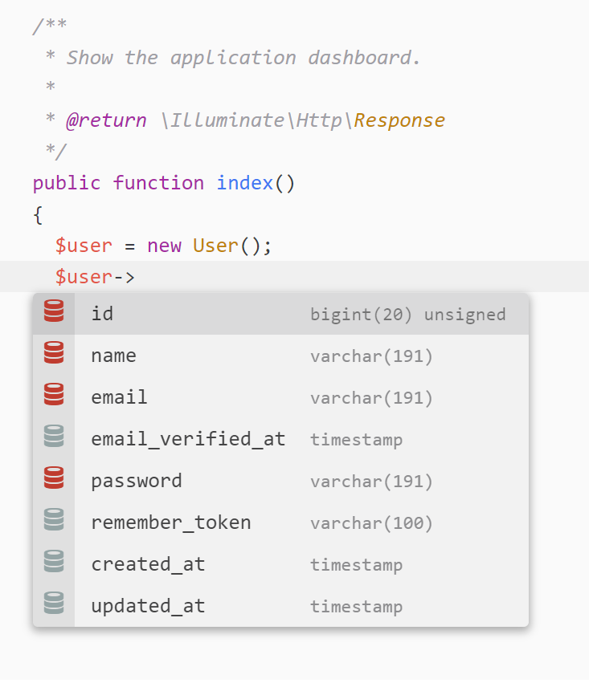

# Laravel Model Attributes package for Atom Editor

Laravel Model Attributes package for Atom targets a Laravel+MySQL projects to assist developers with autocomplete functionality to auto-complete a given Model by taking its name to guess the mysql related table.

to get the results in the autocomplete, just type `->` after your variable, like `$article->`, and you should get the autocomplete suggestions.

Note: Right now it works only if you define you variables like: `$item = new User()`, the package will look for table `users` in your database and get back the columns. if it fails it will look for a table called `items`. so if the variable is not defined like before, you may still use it like `$user`.

NOTE 2: the package says laravel, but in theory it should work with any php+mysql project.

**First Release, This is a beta**

This package is a provider for `autocomplete-plus` package (bundled with Atom)

### Requirements:
- Your project must be using MySQL as database.
- Atom `autocomplete-plus` package (bundled with Atom)
- Now is mandatory have PHP in the environment PATH

### Installation
- `apm install laravel-model-attributes`
- or install through Atom's UI

### Settings
- Enter Database name, user, password and host

### To-Do
- [ ] return Model custom methods
- [ ] find Model by `use App\Class` statement (to break free from pluralize model name to get table name)
- [ ] Apply to other database types

### Thanks to:
- MySQL Nodejs library, it made this possible.
- Vinkla `autocomplete-tailwind`, great package, I went through its code and learned how to make a provider for `autocomplete-plus`.
- Azakur4 `autocomplete-php`, which I copied his README file layout.
