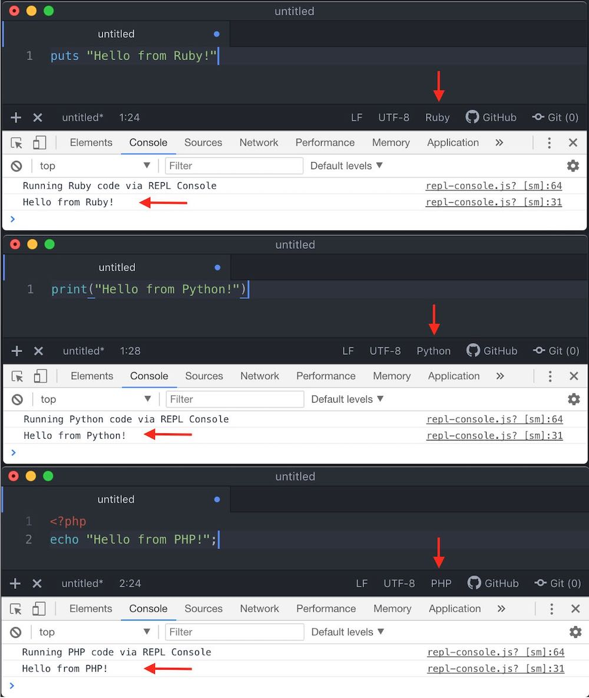

# REPL Console

Run REPL code directly in ATOM. Output is displayed in Dev Tools console.

Supported Languages: Ruby, JavaScript, Python, PHP, Go, Shell Script and JSON

Runtime must be available in system PATH for code to execute in that particular language. JavaScript (and JSON) is the only exception as it runs natively in ATOM.

## Steps to run code

1. Open a new editor tab
2. Set a supported language from the bottom bar
3. Type your code (Including any print statements)
4. Run your code with the shortcut CTRL+ALT+/
5. Dev Tools console will open and the output will be logged to the console
